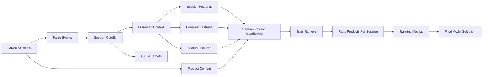

# V2 Recommender Strategy

## Objective

The v2 model strategy should move the project from a binary classification demo on transactions to a credible session-based e-commerce recommender using the Coveo SIGIR eCom 2021 dataset.

The business question is:

> Given the first part of a shopping session, including product views, searches, and cart actions, which products should be ranked highest because the shopper is most likely to click, add, or purchase them next?

This requires session-aware modeling, ranking metrics, realistic candidate generation, strong behavioral baselines, and transparent handling of anonymized product metadata.

## Current State: V1 Baseline

The current implementation in `src/data.py` builds a binary dataset from `Online Retail II`:

- Positive examples: observed `(Customer ID, StockCode)` pairs.
- Negative examples: randomly sampled unobserved customer-product pairs.
- Features: customer aggregates and product aggregates.
- Split: random train/test split.
- Metrics: accuracy, precision, recall, F1.
- Models: Logistic Regression, Random Forest, XGBoost.

This is a valid first POC, but it is now a baseline only. The v2 recommender should be redesigned around Coveo's session-level behavior.

## Main Technical Gaps

### 1. Transaction-only data is not enough

`Online Retail II` only contains purchases. It does not include product views, searches, add-to-cart events, or session context.

### 2. Random split is too optimistic

The current split can mix future information into training features because customer and product aggregates are computed on the full dataset before splitting.

In the v2, validation should simulate the real task: observe early session behavior and predict future session interactions.

### 3. Classification metrics do not measure ranking quality

Accuracy and F1 answer:

> Can the model classify sampled pairs correctly?

A recommender needs to answer:

> Are the products bought in the future present near the top of the ranked recommendation list?

### 4. Random negatives are too easy

Uniformly sampled products that a customer never bought are often obviously irrelevant. A model can perform well on these examples but still fail to rank realistic candidates.

### 5. Features are too coarse

Current features do not include session sequence, search context, add-to-cart intent, product content vectors, category path, or recent interaction order.

### 6. Probability interpretation is risky

`predict_proba` values from tree or logistic models are not automatically calibrated purchase probabilities. The product UI should call them `model scores` unless calibration is added.

## Target Formulation

### Recommendation unit

Each prediction row should represent:

```text
session_id_hash, candidate_product_sku_hash, cutoff_event_index
```

The model scores candidate products for a session after observing only the events up to the cutoff.

### Target

The target should be:

```text
1 if the candidate product appears in the future part of the same session as a target event
0 otherwise
```

Example:

- Observe the first N events in a session.
- Generate candidate products.
- Rank candidates.
- Evaluate whether future clicked, added, or purchased products appear in the top K.

The strongest target for the final product should be future `purchase` events, but intermediate tasks can also predict future `detail` and `add` actions.

## Recommended Pipeline



## Data Splitting Strategy

### Baseline split for v2

Use one of two credible strategies:

1. **Chronological split**
   - Training: earliest sessions.
   - Validation: later sessions.
   - Test: final sessions.

2. **Challenge-style session truncation**
   - Train on complete historical sessions.
   - At evaluation time, reveal only the first part of each session.
   - Predict future interactions after the cutoff.

The second strategy is the most aligned with Coveo's original recommendation task.

### Session eligibility

For a session to be evaluated:

- The observed prefix must contain at least one product interaction.
- The future suffix must contain at least one target product interaction.
- Purchase-focused evaluation should include only sessions with future purchases.
- Add-to-cart and click prediction can use broader session sets.

### Candidate set

For each session, candidate products should include:

- Products viewed earlier in the session.
- Products added to cart earlier in the session.
- Products from search results.
- Products co-visited or co-purchased with observed products.
- Popular products globally or within category.
- Products close to observed products in text/image embedding space.

For evaluation, the candidate set must include future target products.

## Negative Sampling Strategy

### Simple negatives

For each session, sample products that do not appear in the future target events.

### Hard negatives

Include candidates that are plausible but not purchased:

- Popular products.
- Products from the same category as observed products.
- Products from the same search result set that were not clicked.
- Products co-visited or co-carted with observed products.
- Products in the same price bucket.
- Products near observed products in content-vector space.

### Why this matters

Hard negatives make the task closer to real recommendation ranking. A model that can distinguish a future purchase from a random obscure item is less impressive than one that can distinguish it from similar plausible products.

## Feature Strategy

### Session features

| Feature | Meaning |
| --- | --- |
| `session_event_count` | Number of observed events before cutoff |
| `session_product_event_count` | Number of observed product interactions |
| `session_unique_product_count` | Number of unique products observed |
| `session_has_search` | Whether the session includes search behavior |
| `session_has_cart` | Whether the session already contains add-to-cart |
| `session_time_elapsed_ms` | Time between first observed event and cutoff |
| `session_last_event_type` | Most recent observed event type |
| `session_last_product_action` | Most recent product action |

### Product candidate features

| Feature | Meaning |
| --- | --- |
| `product_global_view_count` | Historical product detail/view count |
| `product_global_add_count` | Historical add-to-cart count |
| `product_global_purchase_count` | Historical purchase count |
| `product_conversion_rate` | Purchase count divided by detail/add exposure proxy |
| `product_category_hash` | Coveo category identifier |
| `product_price_bucket` | Coveo price bucket |
| `product_description_vector` | Dense product text representation |
| `product_image_vector` | Dense product image representation |

### Session-product interaction features

| Feature | Meaning |
| --- | --- |
| `candidate_seen_in_session` | Candidate already appeared in observed prefix |
| `candidate_added_in_session` | Candidate already added to cart before cutoff |
| `candidate_in_search_results` | Candidate was shown in a search result set |
| `candidate_clicked_from_search` | Candidate was clicked from search results |
| `same_category_as_observed` | Candidate category matches observed product categories |
| `co_visit_score` | Candidate frequently viewed with observed products |
| `co_cart_score` | Candidate frequently carted with observed products |
| `co_purchase_score` | Candidate frequently purchased with observed products |
| `content_similarity_score` | Candidate content vector similarity to observed products |
| `price_bucket_fit` | Candidate price bucket alignment with observed products |

## Model Strategy

### Required baselines

The v2 should include simple baselines. Without baselines, advanced models are hard to justify.

1. **Random baseline**
   - Randomly rank candidate products.
   - Used only as a sanity check.

2. **Global popularity baseline**
   - Recommend the most clicked, carted, or purchased products.
   - Strong and realistic baseline.

3. **Recent session baseline**
   - Recommend products recently viewed or added in the same session.

4. **Co-visitation / co-cart baseline**
   - Recommend products frequently viewed, carted, or purchased with products already observed in the session.

### Supervised candidate scoring models

Keep the existing family of models but retrain them under the v2 protocol:

- Logistic Regression for interpretability.
- Random Forest for robust non-linear baseline.
- XGBoost for stronger tabular ranking score.

These models should output scores used for ranking, not just binary labels.

### Session and collaborative recommendation models

Add at least one recommender-specific model:

- Item-item co-visitation recommender.
- Item-item co-cart recommender.
- Item-item co-purchase recommender.
- Matrix factorization on implicit interactions if feasible.
- Sequence-aware model if project time allows.

If avoiding new dependencies, start with sparse co-occurrence matrices and cosine similarity from `scikit-learn`.

### Final model choice

The final product model should be selected using:

- Ranking performance.
- Stability across session types.
- Explainability.
- Speed in the Streamlit demo.
- Ease of explaining business value.

The model with the highest metric is not automatically the best product choice if it is slow, unstable, or hard to explain.

## Evaluation Metrics

### Ranking metrics

| Metric | Why it matters |
| --- | --- |
| `Precision@K` | Share of recommended products that are relevant |
| `Recall@K` | Share of future target products captured in the top K |
| `MAP@K` | Rewards relevant products appearing earlier |
| `NDCG@K` | Rewards good ordering and supports graded relevance later |
| `HitRate@K` | Whether at least one future purchase appears in top K |

Use `K = 5`, `K = 10`, and optionally `K = 20`.

### Coverage metrics

| Metric | Why it matters |
| --- | --- |
| Catalog coverage | How many distinct products are recommended |
| Customer coverage | How many customers receive recommendations |
| Long-tail share | Whether recommendations only repeat bestsellers |

### Business proxy metrics

| Metric | Why it matters |
| --- | --- |
| Recommended revenue@K | Revenue value of matched future purchases |
| Average recommended price bucket | Helps understand upsell behavior |
| Performance by session type | Separates browse-only, search, cart, and purchase-intent sessions |

## Calibration Strategy

The v2 should treat model outputs as scores by default.

Only call them probabilities if calibration is implemented and evaluated:

- Use validation period for calibration.
- Consider `CalibratedClassifierCV`.
- Report Brier score or calibration curve if probability claims are made.

Recommended UI wording:

> Recommendation score: relative model affinity used for ranking. It is not a guaranteed purchase probability.

## Recommended Implementation Modules

The current repository can evolve while preserving the required template contracts.

Suggested future modules:

| File | Purpose |
| --- | --- |
| `src/sessionize.py` | Parse Coveo browsing/search data into ordered sessions |
| `src/features.py` | Build session, product, search, and interaction features |
| `src/splitting.py` | Time-based or session-truncation split |
| `src/candidates.py` | Candidate generation and negative sampling |
| `src/recommender_metrics.py` | Ranking metrics |
| `src/recommendation.py` | Score and rank candidate products |
| `src/catalog.py` | Demo catalog reconstruction helpers |

The existing `src/data.py`, `src/metrics.py`, and `scripts/train_models.py` can call these modules later.

## Minimum Credible V2

If time is limited, the minimum credible v2 should include:

1. Coveo data ingestion for browsing, search, and product content.
2. Session-truncation evaluation.
3. Popularity and co-visitation baselines.
4. XGBoost or Random Forest session-product ranker.
5. Precision@10, Recall@10, NDCG@10.
6. Product cards with reconstructed names/images and score explanations.
7. Clear statement that scores are ranking scores, not calibrated probabilities.

## Risks

### Data leakage

All features must be computed from the training history only for each split. Product popularity computed using future purchases would inflate performance.

### Candidate bias

If candidates are only sampled randomly, metrics may look strong but not reflect realistic recommendation difficulty.

### Anonymized catalog

The Coveo dataset is anonymized. The app must not pretend that demo product names and images are original catalog assets.

### Product image mismatch

If images are generated or generic, the app must clearly state that they are a presentation layer.

## Final Recommendation

For v2, use a session-based hybrid strategy:

1. **Popularity, recent-session, co-visitation, and co-cart baselines** for credibility.
2. **Supervised candidate scoring** using session, product, search, and content-vector features.
3. **Item-item co-occurrence models** to represent recommender-specific behavior.
4. **Ranking metrics** as the main evaluation standard.
5. **XGBoost or Random Forest** as likely final demo scorer if it performs well and remains fast.

This provides a credible path without requiring deep learning or production-scale recommender infrastructure, while still using a dataset that strongly resembles real e-commerce behavior.
