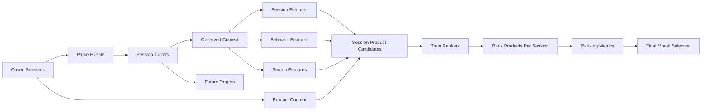

# Stratégie Recommender V2

## Objectif

La v2 transforme le projet en moteur de recommandation e-commerce session-based sur **Coveo SIGIR eCom 2021**. La question business devient:

> Étant donné le début d'une session, incluant vues produit, recherches et actions panier, quels produits doivent être classés en tête parce qu'ils sont les plus pertinents pour la suite de la session?

Cette stratégie exige un protocole session-aware, des métriques de ranking, des candidats réalistes, des baselines comportementales et une présentation transparente des limites du dataset anonymisé.

## État Actuel: Baseline V1

Le pipeline historique se trouve dans `v1/`. Il utilise `Online Retail II` pour construire une classification binaire client-produit:

- exemples positifs: paires `(Customer ID, StockCode)` observées;
- exemples négatifs: paires client-produit non observées échantillonnées aléatoirement;
- features: agrégats client et produit;
- split: train/test aléatoire;
- métriques: accuracy, precision, recall, F1;
- modèles: Logistic Regression, Random Forest, XGBoost.

Cette baseline sert de référence historique. Elle ne doit plus orienter l'architecture cible de `v2/`, qui repose sur les sessions Coveo.

## Écarts Techniques À Corriger

### 1. Les transactions seules ne suffisent pas

`Online Retail II` ne contient que des achats. Il ne couvre pas les vues produit, recherches, ajouts panier ni le contexte de session.

### 2. Le split aléatoire est trop optimiste

Le split v1 peut mélanger des informations futures dans les features, car certains agrégats sont calculés sur tout le dataset avant séparation.

En v2, la validation doit simuler le cas réel: observer le début d'une session et prédire les interactions futures.

### 3. Les métriques de classification ne mesurent pas la qualité de ranking

Accuracy and F1 answer:

> Can the model classify sampled pairs correctly?

Un recommender doit répondre à:

> Are the products bought in the future present near the top of the ranked recommendation list?

### 4. Les négatifs aléatoires sont trop simples

Des produits tirés uniformément sont souvent évidemment non pertinents. Un modèle peut réussir cette tâche tout en échouant à classer des candidats plausibles.

### 5. Les features sont trop grossières

Les features v1 n'incluent pas la séquence de session, le contexte de recherche, l'intention panier, les vecteurs contenu, les catégories ou l'ordre récent des interactions.

### 6. L'interprétation probabiliste est risquée

Les sorties de modèles ne sont pas automatiquement des probabilités d'achat calibrées. L'UI doit parler de `scores de recommandation` ou `scores d'affinité`, sauf calibration explicite.

## Formulation Cible

### Unité de prédiction

Chaque ligne de prédiction représente:

```text
session_id_hash, candidate_product_sku_hash, cutoff_event_index
```

Le modèle score des produits candidats pour une session après avoir observé uniquement les événements avant le cutoff.

### Target

La cible est:

```text
1 if the candidate product appears in the future part of the same session as a target event
0 otherwise
```

Exemple:

- Observer les N premiers événements d'une session.
- Générer des produits candidats.
- Classer les candidats.
- Évaluer si les futurs produits consultés, ajoutés ou achetés apparaissent dans le top K.

La cible business la plus forte reste `purchase`, mais le premier modèle doit progresser de façon robuste: `detail` pour le volume, puis `add`, puis `purchase` en évaluation forte.

## Pipeline Recommandé



## Stratégie De Split

### Split de référence v2

Deux stratégies crédibles:

1. **Split chronologique**
   - Train: sessions les plus anciennes.
   - Validation: sessions suivantes.
   - Test: sessions finales.

2. **Troncature de session**
   - Révéler uniquement le début d'une session.
   - Prédire les interactions futures après cutoff.
   - Mesurer si les futurs produits apparaissent dans le top K.

La troncature de session est la stratégie la plus alignée avec le cas d'usage produit.

### Éligibilité des sessions

Pour évaluer une session:

- Le préfixe observé doit contenir au moins une interaction produit.
- Le suffixe futur doit contenir au moins un produit cible.
- L'évaluation purchase doit filtrer sur les sessions avec achat futur.
- Les targets detail/add peuvent utiliser un volume plus large.

### Ensemble Candidat

Pour chaque session, les candidats peuvent provenir de:

- produits déjà vus dans le préfixe;
- produits ajoutés au panier dans le préfixe;
- produits issus des résultats de recherche;
- produits co-visités ou co-achetés avec les produits observés;
- produits populaires globalement ou par catégorie;
- produits proches en espace texte/image.

Pour l'évaluation, l'ensemble candidat doit inclure les produits cibles futurs.

## Stratégie De Negative Sampling

### Négatifs simples

Échantillonner des produits qui n'apparaissent pas dans les événements cibles futurs.

### Hard negatives

Inclure des candidats plausibles mais non cibles:

- Popular products.
- Products from the same category as observed products.
- Products from the same search result set that were not clicked.
- Products co-visited or co-carted with observed products.
- Products in the same price bucket.
- Products near observed products in content-vector space.

### Pourquoi c'est important

Les hard negatives rapprochent l'évaluation d'un vrai problème de ranking. Distinguer un achat futur d'un produit aléatoire est moins convaincant que le distinguer d'un produit similaire et plausible.

## Stratégie Features

### Features session

| Feature | Meaning |
| --- | --- |
| `session_event_count` | Number of observed events before cutoff |
| `session_product_event_count` | Number of observed product interactions |
| `session_unique_product_count` | Number of unique products observed |
| `session_has_search` | Whether the session includes search behavior |
| `session_has_cart` | Whether the session already contains add-to-cart |
| `session_time_elapsed_ms` | Time between first observed event and cutoff |
| `session_last_event_type` | Most recent observed event type |
| `session_last_product_action` | Most recent product action |

### Features produit candidat

| Feature | Meaning |
| --- | --- |
| `product_global_view_count` | Historical product detail/view count |
| `product_global_add_count` | Historical add-to-cart count |
| `product_global_purchase_count` | Historical purchase count |
| `product_conversion_rate` | Purchase count divided by detail/add exposure proxy |
| `product_category_hash` | Coveo category identifier |
| `product_price_bucket` | Coveo price bucket |
| `product_description_vector` | Dense product text representation |
| `product_image_vector` | Dense product image representation |

### Features interaction session-produit

| Feature | Meaning |
| --- | --- |
| `candidate_seen_in_session` | Candidate already appeared in observed prefix |
| `candidate_added_in_session` | Candidate already added to cart before cutoff |
| `candidate_in_search_results` | Candidate was shown in a search result set |
| `candidate_clicked_from_search` | Candidate was clicked from search results |
| `same_category_as_observed` | Candidate category matches observed product categories |
| `co_visit_score` | Candidate frequently viewed with observed products |
| `co_cart_score` | Candidate frequently carted with observed products |
| `co_purchase_score` | Candidate frequently purchased with observed products |
| `content_similarity_score` | Candidate content vector similarity to observed products |
| `price_bucket_fit` | Candidate price bucket alignment with observed products |

## Stratégie Modèle

### Baselines requises

La v2 doit inclure des baselines simples. Sans baseline, aucun modèle avancé n'est défendable.

1. **Random baseline**
   - Randomly rank candidate products.
   - Used only as a sanity check.

2. **Global popularity baseline**
   - Recommend the most clicked, carted, or purchased products.
   - Strong and realistic baseline.

3. **Recent session baseline**
   - Recommend products recently viewed or added in the same session.

4. **Co-visitation / co-cart baseline**
   - Recommend products frequently viewed, carted, or purchased with products already observed in the session.

### Modèles supervisés de scoring

Les familles de modèles v1 peuvent être réutilisées, mais entraînées sur le protocole v2:

- Logistic Regression for interpretability.
- Random Forest for robust non-linear baseline.
- XGBoost for stronger tabular ranking score.

Ces modèles doivent produire des scores utilisés pour classer les candidats, pas seulement des labels binaires.

### Modèles collaboratifs ou session-based

Ajouter au moins un modèle spécifique au recommender:

- Item-item co-visitation recommender.
- Item-item co-cart recommender.
- Item-item co-purchase recommender.
- Matrix factorization on implicit interactions if feasible.
- Sequence-aware model if project time allows.

Si l'on évite de nouvelles dépendances, commencer par matrices de cooccurrence sparse et similarité cosine avec `scikit-learn`.

### Choix du modèle final

Le modèle final doit être choisi selon:

- Ranking performance.
- Stability across session types.
- Explainability.
- Speed in the Streamlit demo.
- Ease of explaining business value.

Le meilleur score offline ne suffit pas si le modèle est lent, instable ou difficile à expliquer.

## Métriques D'Évaluation

### Métriques ranking

| Metric | Why it matters |
| --- | --- |
| `Precision@K` | Share of recommended products that are relevant |
| `Recall@K` | Share of future target products captured in the top K |
| `MAP@K` | Rewards relevant products appearing earlier |
| `NDCG@K` | Rewards good ordering and supports graded relevance later |
| `HitRate@K` | Whether at least one future purchase appears in top K |

Utiliser `K = 5`, `K = 10` et éventuellement `K = 20`.

### Métriques de couverture

| Metric | Why it matters |
| --- | --- |
| Catalog coverage | How many distinct products are recommended |
| Customer coverage | How many customers receive recommendations |
| Long-tail share | Whether recommendations only repeat bestsellers |

### Proxies business

| Metric | Why it matters |
| --- | --- |
| Recommended revenue@K | Revenue value of matched future purchases |
| Average recommended price bucket | Helps understand upsell behavior |
| Performance by session type | Separates browse-only, search, cart, and purchase-intent sessions |

## Stratégie De Calibration

La v2 doit traiter les sorties modèle comme des scores par défaut.

Ne parler de probabilités que si une calibration est implémentée et évaluée:

- Use validation period for calibration.
- Consider `CalibratedClassifierCV`.
- Report Brier score or calibration curve if probability claims are made.

Formulation UI recommandée:

> Score de recommandation: affinité relative utilisée pour classer les produits. Ce n'est pas une probabilité d'achat garantie.

## Modules D'Implémentation Recommandés

Le dépôt est désormais séparé en `v1/` et `v2/`. Les nouveaux modules doivent être créés sous `v2/src/`.

Modules proposés:

| File | Purpose |
| --- | --- |
| `v2/src/sessionize.py` | Parser les événements Coveo en sessions ordonnées |
| `v2/src/splitting.py` | Construire préfixes, suffixes, cutoffs et splits |
| `v2/src/candidates.py` | Générer candidats et négatifs |
| `v2/src/features.py` | Construire features session, produit, recherche et interaction |
| `v2/src/recommender_metrics.py` | Calculer les métriques de ranking |
| `v2/src/recommendation.py` | Scorer et classer les produits candidats |
| `v2/src/catalog.py` | Préparer la couche catalogue de démonstration |

Les scripts v2 d'entraînement et d'évaluation pourront orchestrer ces modules ensuite.

## Minimum Crédible V2

Si le temps est limité, la v2 minimale crédible doit inclure:

1. Ingestion Coveo browsing et product content.
2. Évaluation par troncature de session.
3. Baselines popularité et co-visitation.
4. Ranker session-produit Random Forest ou XGBoost.
5. `Precision@10`, `Recall@10`, `NDCG@10`.
6. Cartes produits avec noms/images reconstruits et explications.
7. Mention claire que les scores sont des scores de ranking.

## Risques

### Fuite de données

Toutes les features doivent être calculées sans utiliser le futur du cutoff ou du split.

### Biais de candidats

Des candidats uniquement aléatoires peuvent produire des métriques flatteuses mais irréalistes.

### Catalogue anonymisé

Coveo est anonymisé. L'app ne doit pas présenter les noms et images demo comme des assets source.

### Décalage visuel produit

Si les images sont générées ou génériques, l'app doit indiquer qu'il s'agit d'une couche de présentation.

## Final Recommendation

For v2, use a session-based hybrid strategy:

1. **Popularity, recent-session, co-visitation, and co-cart baselines** for credibility.
2. **Supervised candidate scoring** using session, product, search, and content-vector features.
3. **Item-item co-occurrence models** to represent recommender-specific behavior.
4. **Ranking metrics** as the main evaluation standard.
5. **XGBoost or Random Forest** as likely final demo scorer if it performs well and remains fast.

This provides a credible path without requiring deep learning or production-scale recommender infrastructure, while still using a dataset that strongly resembles real e-commerce behavior.
